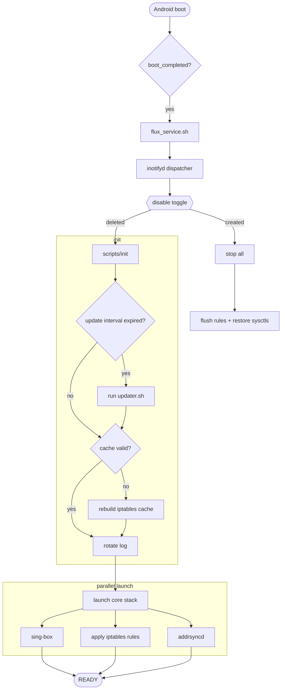
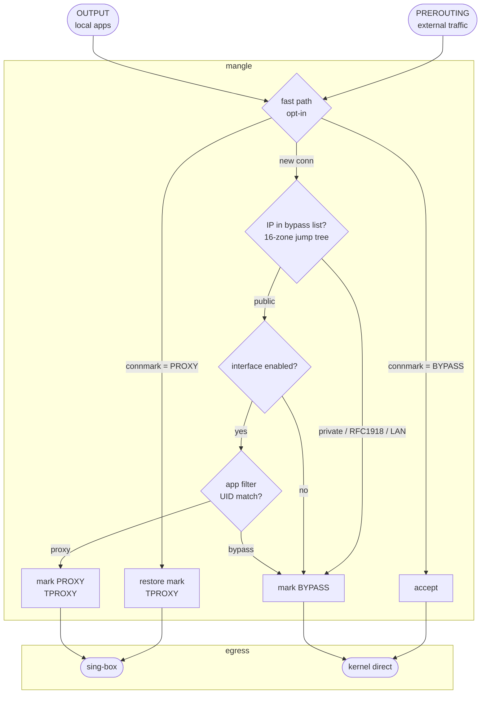

# Flux

[English](README.md) | [简体中文](README_zh.md)

> Transparent proxy for Android, powered by [sing-box](https://sing-box.sagernet.org/).

A Magisk / KernelSU / APatch module that wires sing-box into Android's network stack via netfilter TPROXY. Built for Android arm64.

## Highlights

- **TPROXY data path** — TCP and UDP traversal via a netfilter mangle chain. Protocol-agnostic; no L7 inspection in-kernel.
- **Stateful fast path** — connection-marked flows take a `xt_socket + connmark` shortcut and skip the bypass tree (opt-in via `PERFORMANCE_MODE=1`).
- **Per-interface and per-app routing** — independent switches for mobile / Wi-Fi / hotspot / USB-tether, plus UID-based allow/deny lists.
- **Live address sync (`addrsyncd`)** — a Rust daemon that watches `RTM_NEWADDR`/`RTM_DELADDR` netlink events and keeps the PBR routing table in step. Optimized for Android arm64.
- **Subscription pipeline** — bundled converter normalises remote subscriptions into sing-box outbounds, with regex-based region filtering and per-tag rename rules.
- **Hot reload** — `inotifyd` watches `conf/`; valid config changes apply without a full restart.
- **Cooperative DNS** — `PRIVATE_DNS_GUARD=auto` only overrides Android Private DNS when it would actually bypass sing-box (i.e. `private_dns_mode=hostname`).
- **CLI control plane** — `fluxctl status / start / stop / restart / validate / stats / diagnose / rules-preview / logs / resync`.
- **Web dashboard** — Zashboard UI at `http://127.0.0.1:9090/ui/`.

## Installation

1. Grab the latest `flux-<version>.zip` from [Releases](https://github.com/Chth1z/Flux/releases).
2. Install in Magisk / KernelSU / APatch.
3. During install:
   - **[Vol+]** keep existing settings
   - **[Vol-]** reset to defaults
4. Set `SUBSCRIPTION_URL` in `/data/adb/flux/conf/settings.ini`.
5. Reboot.

## Building from source

```bash
# Full module (compiles addrsyncd, downloads sing-box + jq, verifies SHA-256)
make package

# Lite zip (no bin/; user supplies sing-box / jq / addrsyncd)
make package-lite

# Pin upstream versions
bash tools/package.sh --singbox-version v1.10.4 --jq-version jq-1.7.1
```

Host requirements: `bash`, `curl`, `jq`, `sha256sum`, `tar`, `unzip`, `zip` — and for addrsyncd, `cargo` + Android NDK clang linker (`aarch64-linux-android21-clang` on `PATH`). See `tools/README.md`.

Output: `dist/flux-<version>.zip`. The zip carries `conf/manifest.json` populated with resolved upstream versions and SHA-256s.

## Architecture

### Module lifecycle



### Packet path



## Directory layout

After install (`/data/adb/flux/`):

```
/data/adb/flux/
├── bin/
│   ├── addrsyncd            # address-sync daemon (Rust, arm64)
│   ├── jq                   # JSON processor
│   └── sing-box             # proxy core
├── conf/
│   ├── addrsyncd.toml       # addrsyncd config
│   ├── bypass.v4.list       # optional, user-extensible IPv4 bypass CIDRs
│   ├── bypass.v6.list       # optional, user-extensible IPv6 bypass CIDRs
│   ├── config.json          # generated sing-box config
│   ├── manifest.json        # binary version + SHA-256 manifest
│   ├── settings.ini         # user configuration
│   └── template.json        # sing-box config template
├── run/                     # pid files, log, runtime state
│   ├── flux.log
│   ├── sing-box.pid
│   ├── addrsyncd.pid
│   └── event/
└── scripts/
    ├── addrsync             # addrsyncd lifecycle wrapper
    ├── config               # settings.ini schema + sing-box check
    ├── core                 # sing-box process control
    ├── dispatcher           # inotifyd event handler
    ├── fluxctl              # CLI control plane
    ├── init                 # boot-time initialisation
    ├── lib                  # shared constants / helpers
    ├── log                  # logging
    ├── rules                # iptables rule generator
    ├── tproxy               # apply / cleanup tproxy rules + sysctls
    └── updater.sh           # subscription updater
```

Magisk module dir (`/data/adb/modules/flux/`): standard module layout — `webroot/index.html` (UI redirect), `service.sh` (boot launcher), `module.prop`, `disable` (when disabled).

## Configuration

`/data/adb/flux/conf/settings.ini`. Changes take effect after service restart, or on inotify event for hot-reload-safe keys.

### Subscription & updater

| Option | Description | Default |
|---|---|---|
| `SUBSCRIPTION_URL` | Subscription URL for the converter | (empty) |
| `UPDATE_TIMEOUT` | Per-download timeout in seconds | `5` |
| `RETRY_COUNT` | Retries for failed downloads | `2` |
| `UPDATE_INTERVAL` | Auto-update interval in seconds (`0` disables) | `86400` |
| `PREF_CLEANUP_EMOJI` | Strip emoji from node names | `1` |
| `UPDATER_EXCLUDE_REMARKS` | Regex of node names to drop | (built-in) |
| `UPDATER_RENAME_RULES` | JSON array of regex → replacement rules | `[]` |
| `UPDATER_MAX_TAG_LENGTH` | Max sing-box tag length | `32` |

### Logging

| Option | Description | Default |
|---|---|---|
| `LOG_LEVEL` | `0` off · `1` error · `2` warn · `3` info · `4` debug | `3` |
| `LOG_MAX_SIZE` | Bytes before rotation | `1048576` |

### Core process

| Option | Description | Default |
|---|---|---|
| `CORE_USER` / `CORE_GROUP` | sing-box runtime uid/gid (used by loopback REJECT and `xt_owner`) | `root` |
| `CORE_TIMEOUT` | Startup readiness timeout in seconds | `5` |

### Proxy engine

| Option | Description | Default |
|---|---|---|
| `PROXY_PORT` | TPROXY listen port (auto-extracted from `config.json`) | `1536` |
| `FAKEIP_V4_RANGE` / `FAKEIP_V6_RANGE` | sing-box fake-IP ranges (auto-extracted) | `198.18.0.0/15` / `fc00::/18` |
| `PROXY_MODE` | `tproxy` (netfilter) or `tun` (sing-box TUN inbound) | `tproxy` |
| `PROXY_IPV6` | Enable IPv6 family alongside IPv4 | `0` |
| `TUN_INTERFACE` / `TUN_INET4_ADDRESS` / `TUN_INET6_ADDRESS` / `TUN_MTU` | Read only when `PROXY_MODE=tun` | `tun0` / `172.19.0.1/30` / `fdfe:dcba:9876::1/126` / `9000` |

### Network interfaces

| Option | Description | Default |
|---|---|---|
| `MOBILE_INTERFACE` | Mobile-data interface (supports `+` wildcard) | `rmnet_data+` |
| `WIFI_INTERFACE` | Wi-Fi interface | `wlan0` |
| `HOTSPOT_INTERFACE` | Hotspot interface — empty by default; set to e.g. `wlan2` only if your device has one | (empty) |
| `USB_INTERFACE` | USB-tether interface | `rndis+` |
| `EXCLUDE_INTERFACES` | Space-separated list to bypass (OUTPUT chain). Defaults catch WireGuard via `wg+` | `wg+` |

### Per-interface proxy switches

| Option | Description | Default |
|---|---|---|
| `PROXY_MOBILE` / `PROXY_WIFI` | Proxy traffic from these interfaces | `1` |
| `PROXY_HOTSPOT` / `PROXY_USB` | Proxy hotspot / USB-tether clients | `1` |

### App filtering

| Option | Description | Default |
|---|---|---|
| `APP_PROXY_MODE` | `0` off · `1` blacklist · `2` whitelist | `0` |
| `APP_LIST` | Package names (space or newline separated) | (empty) |
| `APP_USER_SCOPE` | `owner` · `all` · `list` | `owner` |
| `APP_USER_LIST` | Android user IDs (space-separated) when scope is `list` | `0` |
| `ROUTING_MARK` | Fallback routing mark for `xt_mark` when `xt_owner` is unavailable | (empty) |

### Compatibility & performance

| Option | Description | Default |
|---|---|---|
| `MSS_CLAMP_ENABLE` | Clamp TCP MSS to PMTU on POSTROUTING | `1` |
| `BLOCK_QUIC` | Drop UDP/443 globally (works around sing-box+QUIC issues) | `0` |
| `MARK_MASK` | Connmark mask (keep low byte for Flux; high bits stay free for vendor QoS) | `0xff` |
| `PERFORMANCE_MODE` | Enable `xt_socket + connmark` fast-path (kernel auto-detected) | `0` |
| `SOCKET_UDP_PROBE` | `auto` · `off` · `on` — runtime probe for UDP `--transparent` | `auto` |
| `PRIVATE_DNS_GUARD` | `off` · `strict` · `auto` (or `0`/`1` legacy aliases). `auto` overrides Android Private DNS only when current mode is `hostname` | `off` |
| `IPV6_FORCE_DISABLE` | Set `disable_ipv6=1` (system-wide — affects every app) | `0` |
| `HOTSPOT_FIX` | Set `ip_forward=1` for tethering-share scenarios | `0` |
| `LOCALNET_FIX` | Set `route_localnet=1` (localhost DNAT debugging) | `0` |

### Conntrack and socket tuning (opt-in, default empty)

All values are snapshot at apply and restored on dispatcher stop. Empty = leave kernel default.

| Option | Description | Suggested |
|---|---|---|
| `CONNTRACK_MAX` | `net.netfilter.nf_conntrack_max` (entries) | `131072` (>2 GiB RAM); `262144` (>4 GiB RAM) |
| `CONNTRACK_UDP_STREAM_TIMEOUT` | `nf_conntrack_udp_timeout_stream` (seconds) | `60` (reclaim QUIC bursts faster than the 180 s default) |
| `CONNTRACK_TCP_CLOSE_WAIT_TIMEOUT` | `nf_conntrack_tcp_timeout_close_wait` (seconds) | `30` (default 60) |
| `SOCKET_BUFFER_MAX` | Symmetric `net.core.{rmem,wmem}_max` ceiling for sing-box's UDP listener | `4194304` (4 MiB); `16777216` (16 MiB heavy WebRTC/QUIC) |

### Extensible bypass list

Optional files — create if needed; not shipped, survive module updates:

```
/data/adb/flux/conf/bypass.v4.list
/data/adb/flux/conf/bypass.v6.list
```

One CIDR per line, `#` for comments, blank lines ignored. Entries are **additively** merged with the built-in carrier-safe defaults; built-ins cannot be removed (loopback safety). Malformed lines emit a `log_warn` and the apply continues.

## CLI

```bash
fluxctl=/data/adb/flux/scripts/fluxctl

$fluxctl status          # service state, pid files, last log line
$fluxctl start
$fluxctl stop
$fluxctl restart
$fluxctl validate        # sing-box check -c on current config.json
$fluxctl stats           # iptables counters + addrsyncd status + Clash API
$fluxctl rules-preview   # render current iptables ruleset without applying
$fluxctl diagnose        # bundle log tail + kernel features + active runtime
$fluxctl logs            # tail flux.log
$fluxctl resync          # signal addrsyncd to re-walk addresses
```

## Disclaimer

For educational and research use only. Modifying system network state can destabilise the device; you are responsible for what you install. The author is not liable for data loss or device damage.

## Credits

- [SagerNet/sing-box](https://github.com/SagerNet/sing-box) — proxy core
- [jqlang/jq](https://github.com/jqlang/jq) — JSON processor
- [CHIZI-0618/box4magisk](https://github.com/CHIZI-0618/box4magisk), [taamarin/box_for_magisk](https://github.com/taamarin/box_for_magisk) — Magisk-module patterns

## License

[GPL-3.0](LICENSE)
