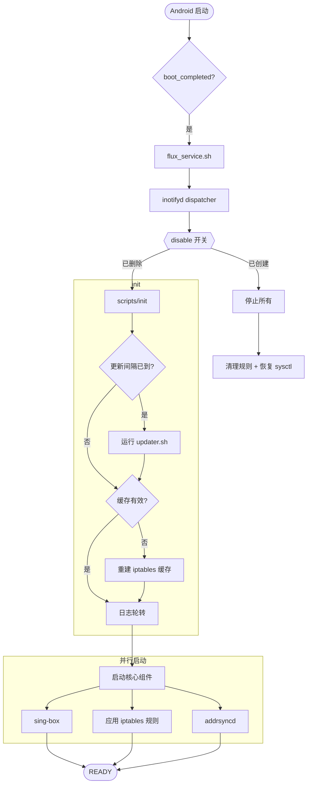
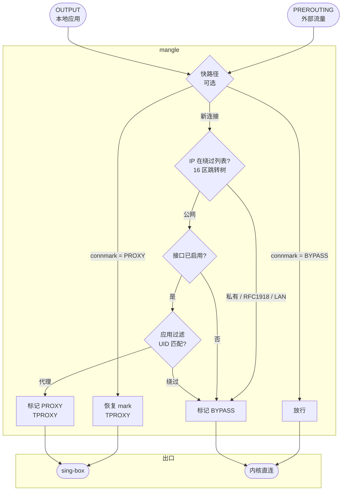

# Flux

[English](README.md) | [简体中文](README_zh.md)

> Android 透明代理，基于 [sing-box](https://sing-box.sagernet.org/)。

通过 netfilter TPROXY 把 sing-box 接入 Android 网络栈的 Magisk / KernelSU / APatch 模块。面向 Android arm64。

## 主要特性

- **TPROXY 数据面** —— 通过 netfilter mangle 链承载 TCP/UDP 流量；协议无关，内核态不做 L7 解析。
- **有状态快路径** —— 已被 connmark 标记的连接走 `xt_socket + connmark` 捷径，跳过绕过树（`PERFORMANCE_MODE=1` 启用）。
- **按接口、按应用路由** —— 移动数据 / Wi-Fi / 热点 / USB 共享各自独立开关，叠加 UID 黑白名单。
- **地址实时同步（`addrsyncd`）** —— 用 Rust 实现的 daemon，监听 `RTM_NEWADDR`/`RTM_DELADDR` netlink 事件，保持 PBR 路由表始终一致。针对 Android arm64 优化。
- **订阅流水线** —— 内置转换器把远端订阅规范化为 sing-box outbound，支持按正则的地区过滤和按标签的重命名规则。
- **热重载** —— `inotifyd` 监视 `conf/`；合法的配置变更无需整段重启。
- **协作式 DNS** —— `PRIVATE_DNS_GUARD=auto` 仅在 Android Private DNS 真会绕过 sing-box（即 `private_dns_mode=hostname`）时才接管。
- **命令行控制面** —— `fluxctl status / start / stop / restart / validate / stats / diagnose / rules-preview / logs / resync`。
- **Web 面板** —— Zashboard UI 位于 `http://127.0.0.1:9090/ui/`。

## 安装

1. 从 [Releases](https://github.com/Chth1z/Flux/releases) 下载最新的 `flux-<version>.zip`。
2. 在 Magisk / KernelSU / APatch 中安装。
3. 安装过程中：
   - **[音量+]** 保留现有配置
   - **[音量-]** 重置为默认
4. 在 `/data/adb/flux/conf/settings.ini` 中设置 `SUBSCRIPTION_URL`。
5. 重启。

## 从源码构建

```bash
# 完整包（编译 addrsyncd，下载 sing-box + jq，校验 SHA-256）
make package

# 精简包（不含 bin/，由用户自备 sing-box / jq / addrsyncd）
make package-lite

# 指定上游版本
bash tools/package.sh --singbox-version v1.10.4 --jq-version jq-1.7.1
```

主机要求：`bash`、`curl`、`jq`、`sha256sum`、`tar`、`unzip`、`zip`；构建 addrsyncd 还需要 `cargo` 与 Android NDK 的 clang linker（`PATH` 中可调用 `aarch64-linux-android21-clang`）。详见 `tools/README.md`。

产物：`dist/flux-<version>.zip`。压缩包内带有 `conf/manifest.json`，记录解析后的上游版本号与所有二进制的 SHA-256。

## 架构

### 模块生命周期



### 数据包路径



## 目录结构

安装后（`/data/adb/flux/`）：

```
/data/adb/flux/
├── bin/
│   ├── addrsyncd            # 地址同步 daemon（Rust，arm64）
│   ├── jq                   # JSON 处理器
│   └── sing-box             # 代理核心
├── conf/
│   ├── addrsyncd.toml       # addrsyncd 配置
│   ├── bypass.v4.list       # 可选，用户自定义 IPv4 绕过 CIDR
│   ├── bypass.v6.list       # 可选，用户自定义 IPv6 绕过 CIDR
│   ├── config.json          # 生成的 sing-box 配置
│   ├── manifest.json        # 二进制版本与 SHA-256 清单
│   ├── settings.ini         # 用户配置
│   └── template.json        # sing-box 配置模板
├── run/                     # pid 文件、日志、运行时状态
│   ├── flux.log
│   ├── sing-box.pid
│   ├── addrsyncd.pid
│   └── event/
└── scripts/
    ├── addrsync             # addrsyncd 生命周期封装
    ├── config               # settings.ini schema + sing-box check
    ├── core                 # sing-box 进程控制
    ├── dispatcher           # inotifyd 事件处理
    ├── fluxctl              # CLI 控制面
    ├── init                 # 引导期初始化
    ├── lib                  # 共用常量与工具函数
    ├── log                  # 日志
    ├── rules                # iptables 规则生成器
    ├── tproxy               # 应用 / 清理 tproxy 规则与 sysctl
    └── updater.sh           # 订阅更新器
```

Magisk 模块目录（`/data/adb/modules/flux/`）：标准模块布局 —— `webroot/index.html`（面板跳转）、`service.sh`（启动脚本）、`module.prop`、`disable`（禁用时存在）。

## 配置

`/data/adb/flux/conf/settings.ini`。修改在服务重启后生效；对可热重载的键，inotify 事件触发即可。

### 订阅与更新器

| 选项 | 描述 | 默认 |
|---|---|---|
| `SUBSCRIPTION_URL` | 用于转换器的订阅地址 | （空）|
| `UPDATE_TIMEOUT` | 单次下载超时（秒）| `5` |
| `RETRY_COUNT` | 下载失败重试次数 | `2` |
| `UPDATE_INTERVAL` | 自动更新间隔（秒，`0` 禁用）| `86400` |
| `PREF_CLEANUP_EMOJI` | 移除节点名中的 emoji | `1` |
| `UPDATER_EXCLUDE_REMARKS` | 用于过滤节点名的正则 | （内置）|
| `UPDATER_RENAME_RULES` | JSON 数组形式的「正则 → 替换」规则 | `[]` |
| `UPDATER_MAX_TAG_LENGTH` | sing-box tag 最大长度 | `32` |

### 日志

| 选项 | 描述 | 默认 |
|---|---|---|
| `LOG_LEVEL` | `0` 关闭 · `1` 错误 · `2` 警告 · `3` 信息 · `4` 调试 | `3` |
| `LOG_MAX_SIZE` | 轮转前的字节数 | `1048576` |

### 核心进程

| 选项 | 描述 | 默认 |
|---|---|---|
| `CORE_USER` / `CORE_GROUP` | sing-box 运行身份（loopback REJECT 与 `xt_owner` 都依赖）| `root` |
| `CORE_TIMEOUT` | 启动就绪超时（秒）| `5` |

### 代理引擎

| 选项 | 描述 | 默认 |
|---|---|---|
| `PROXY_PORT` | TPROXY 监听端口（自动从 `config.json` 提取）| `1536` |
| `FAKEIP_V4_RANGE` / `FAKEIP_V6_RANGE` | sing-box fake-IP 段（自动提取）| `198.18.0.0/15` / `fc00::/18` |
| `PROXY_MODE` | `tproxy`（netfilter）或 `tun`（sing-box TUN 入站）| `tproxy` |
| `PROXY_IPV6` | 在 IPv4 之外启用 IPv6 | `0` |
| `TUN_INTERFACE` / `TUN_INET4_ADDRESS` / `TUN_INET6_ADDRESS` / `TUN_MTU` | 仅在 `PROXY_MODE=tun` 时读取 | `tun0` / `172.19.0.1/30` / `fdfe:dcba:9876::1/126` / `9000` |

### 网络接口

| 选项 | 描述 | 默认 |
|---|---|---|
| `MOBILE_INTERFACE` | 移动数据接口（支持 `+` 通配符）| `rmnet_data+` |
| `WIFI_INTERFACE` | Wi-Fi 接口 | `wlan0` |
| `HOTSPOT_INTERFACE` | 热点接口 —— 默认为空；仅在设备有独立热点接口（如 `wlan2`）时设置 | （空）|
| `USB_INTERFACE` | USB 共享接口 | `rndis+` |
| `EXCLUDE_INTERFACES` | 空格分隔的绕过接口列表（OUTPUT 链）；默认通过 `wg+` 捕获 WireGuard | `wg+` |

### 按接口代理开关

| 选项 | 描述 | 默认 |
|---|---|---|
| `PROXY_MOBILE` / `PROXY_WIFI` | 是否代理这些接口的流量 | `1` |
| `PROXY_HOTSPOT` / `PROXY_USB` | 是否代理热点 / USB 共享客户端 | `1` |

### 应用过滤

| 选项 | 描述 | 默认 |
|---|---|---|
| `APP_PROXY_MODE` | `0` 关闭 · `1` 黑名单 · `2` 白名单 | `0` |
| `APP_LIST` | 包名（空格或换行分隔）| （空）|
| `APP_USER_SCOPE` | `owner` · `all` · `list` | `owner` |
| `APP_USER_LIST` | scope 为 `list` 时使用的 Android 用户 ID（空格分隔）| `0` |
| `ROUTING_MARK` | `xt_owner` 不可用时的备用 `xt_mark` 路由标记 | （空）|

### 兼容性与性能

| 选项 | 描述 | 默认 |
|---|---|---|
| `MSS_CLAMP_ENABLE` | 在 POSTROUTING 上将 TCP MSS 钳到 PMTU | `1` |
| `BLOCK_QUIC` | 全局丢弃 UDP/443（规避 sing-box + QUIC 已知问题）| `0` |
| `MARK_MASK` | Connmark 掩码；低字节留给 Flux，高位保留给厂商 QoS | `0xff` |
| `PERFORMANCE_MODE` | 启用 `xt_socket + connmark` 快路径（内核能力自动探测）| `0` |
| `SOCKET_UDP_PROBE` | `auto` · `off` · `on` —— UDP `--transparent` 运行时探测 | `auto` |
| `PRIVATE_DNS_GUARD` | `off` · `strict` · `auto`（兼容 `0` / `1`）。`auto` 仅在 Private DNS 模式为 `hostname` 时接管 | `off` |
| `IPV6_FORCE_DISABLE` | 设置 `disable_ipv6=1`（系统级 —— 影响所有应用）| `0` |
| `HOTSPOT_FIX` | 设置 `ip_forward=1`，用于共享场景 | `0` |
| `LOCALNET_FIX` | 设置 `route_localnet=1`，用于 localhost DNAT 调试 | `0` |

### Conntrack 与 socket 缓冲（按需开启，默认为空）

所有值在应用时快照，在 dispatcher 停止时恢复。空 = 保留内核默认。

| 选项 | 描述 | 建议值 |
|---|---|---|
| `CONNTRACK_MAX` | `net.netfilter.nf_conntrack_max`（条目数）| `131072`（>2 GiB 内存）；`262144`（>4 GiB 内存）|
| `CONNTRACK_UDP_STREAM_TIMEOUT` | `nf_conntrack_udp_timeout_stream`（秒）| `60`（让 QUIC 突发比 180 s 默认值更快回收）|
| `CONNTRACK_TCP_CLOSE_WAIT_TIMEOUT` | `nf_conntrack_tcp_timeout_close_wait`（秒）| `30`（默认 60）|
| `SOCKET_BUFFER_MAX` | 同时设置 `net.core.{rmem,wmem}_max` 上限，供 sing-box UDP 监听 | `4194304`（4 MiB）；`16777216`（16 MiB，WebRTC/QUIC 大量并发）|

### 可扩展的绕过名单

可选文件 —— 按需创建，不随模块发布，且能在更新中保留：

```
/data/adb/flux/conf/bypass.v4.list
/data/adb/flux/conf/bypass.v6.list
```

每行一条 CIDR，`#` 开头为注释，空行忽略。条目**附加**到内置的载波安全默认列表之上；内置项不可移除（保护 loopback）。格式错误的行触发 `log_warn` 但不阻止应用。

## 命令行

```bash
fluxctl=/data/adb/flux/scripts/fluxctl

$fluxctl status          # 服务状态、pid 文件、最近一行日志
$fluxctl start
$fluxctl stop
$fluxctl restart
$fluxctl validate        # 对当前 config.json 执行 sing-box check
$fluxctl stats           # iptables 计数器 + addrsyncd 状态 + Clash API
$fluxctl rules-preview   # 渲染当前 iptables 规则（不应用）
$fluxctl diagnose        # 汇总日志尾段、内核能力、活动运行时
$fluxctl logs            # tail flux.log
$fluxctl resync          # 通知 addrsyncd 重新遍历地址
```

## 免责声明

仅供教育与研究使用。修改系统网络状态可能导致设备不稳定，您需对自己安装的内容负责。作者不对由此造成的数据丢失或设备损坏承担责任。

## 鸣谢

- [SagerNet/sing-box](https://github.com/SagerNet/sing-box) —— 代理核心
- [jqlang/jq](https://github.com/jqlang/jq) —— JSON 处理器
- [CHIZI-0618/box4magisk](https://github.com/CHIZI-0618/box4magisk)、[taamarin/box_for_magisk](https://github.com/taamarin/box_for_magisk) —— Magisk 模块模式

## 许可证

[GPL-3.0](LICENSE)
